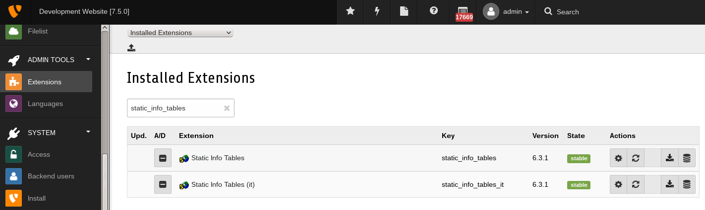

.. ==================================================
.. FOR YOUR INFORMATION
.. --------------------------------------------------
.. -*- coding: utf-8 -*- with BOM.

.. include:: ../Includes.txt

.. _admin-manual:

Administrator Manual
====================

Installation
------------

The extension is simply installed using the Extension Manager.

When installing for the **very first time**, the database updates are performed **automatically**. When **re-installing** after an uninstall or when **updating**, the update script needs to be run **manually** in the Extension Manager.

**Note:** It is not recommended to change data manually since changes will be lost the next time you run the update script. If you find any data error please report them via email to the extension author.

	Extension Manager

	Filtered list of extensions within the Extension Manager also shortend as "EM"

FAQ
^^^

See the extension static_info_tables.