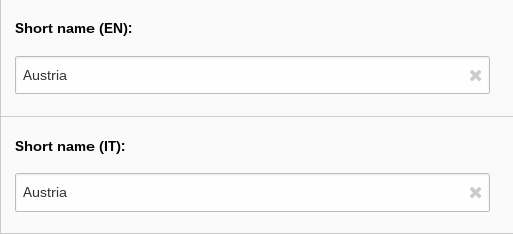

.. ==================================================
.. FOR YOUR INFORMATION
.. --------------------------------------------------
.. -*- coding: utf-8 -*- with BOM.

.. include:: ../Includes.txt

What does it do?
================

This extension provides Italian translation for the country, country subdivision, currency, language, and territory records of static_info_tables. For this purpose, it adds one or two fields to the those tables and fills them with Polish data, if available.

	Record view of a "Polish" country record with new field "Short name (PL)" filled with the Polish translation.
